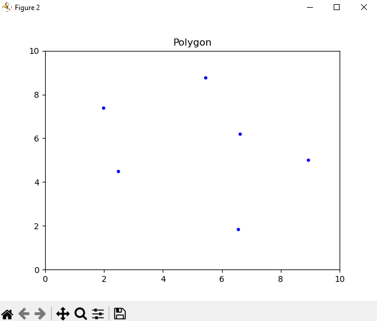
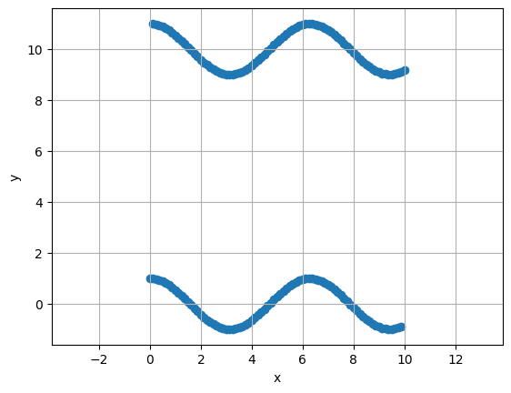
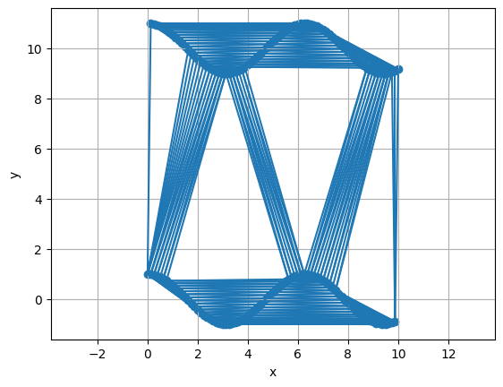
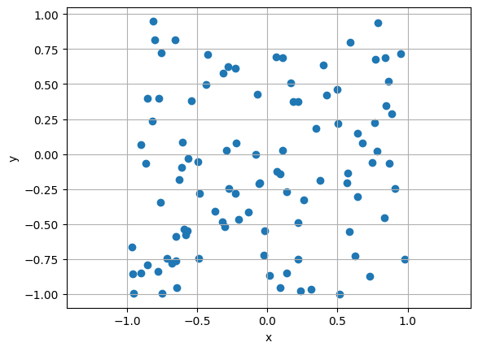
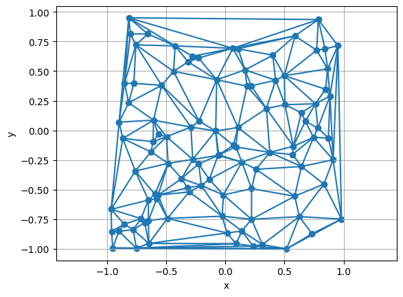

# Geometric Algorithms

Repository from geometric algorithms course, including:
-  Jarvis and Graham Algorithms for Convex Hull Problem
-  Polygon Triangulation Algorithm
-  Plane Sweep Algorithm for Computing Line Segment Intersections
-  Delaunay Triangulation Algorithm with comparison with monotone polygon triangulation

Projects feature visualization which also enables user input

## Delaunay Triangulation Project

This project allows user-defined input — points are added by clicking the left mouse button inside the window:

The project supports several predefined datasets:
- points on a circle
- points on a sine wave
- random point sets

Then the program computes a **Delaunay triangulation**, producing triangles that maximize the minimal angle and tend to form shapes close to equilateral triangles.

Example inputs and outputs:

### How to run

To run the project (and other ones) follow these steps:
- clone the repo
- open selected folder in your IDE or Jupyter Notebook
- install required libraries, such as Numpy, Matplotlib
- run cells by either clicking the "run" button, ot by Shift + Enter
